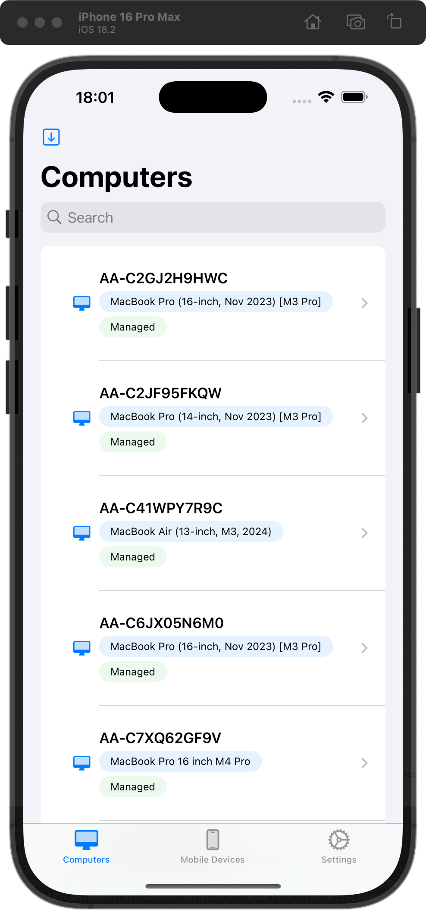
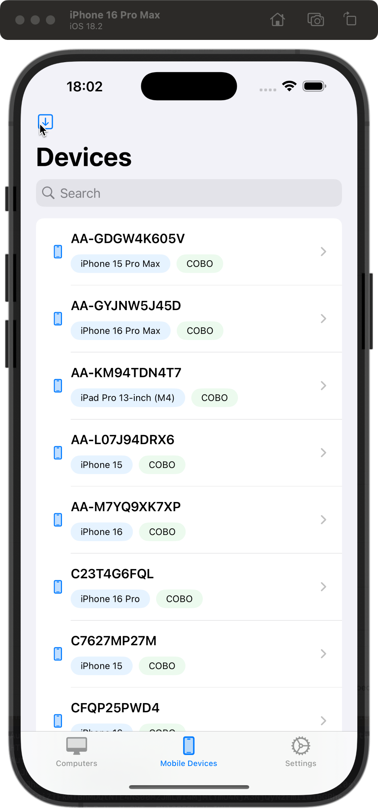
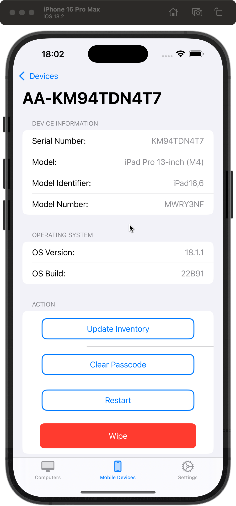

# JamfApp

JamfApp is an early-stage alpha project designed to simplify macOS device management using the Jamf API. As this is a work in progress, I am actively seeking feedback and contributors to help shape its development.

## Features
- Integration with the Jamf API for managing macOS devices.
- List computers and mobile devices
- Detail view from mobile devices

## Screenshots
Below are example screenshots from the app:

1. 
2. 
3. 

## ToDos
- Switch from XML to JSON
- Added detail view for computers
- Added more stuff to detail views
- Added dark mode

## Contributing
Contributions are highly welcome! If you have ideas or find issues, please open a GitHub issue or submit a pull request.

## Help Needed
As an alpha project, JamfApp needs:
- Testers to identify bugs and provide feedback.
- Developers to contribute to new features and code improvements.
- Designers to enhance the UI and overall user experience.

If you are interested in contributing, please reach out or open an issue on GitHub.

